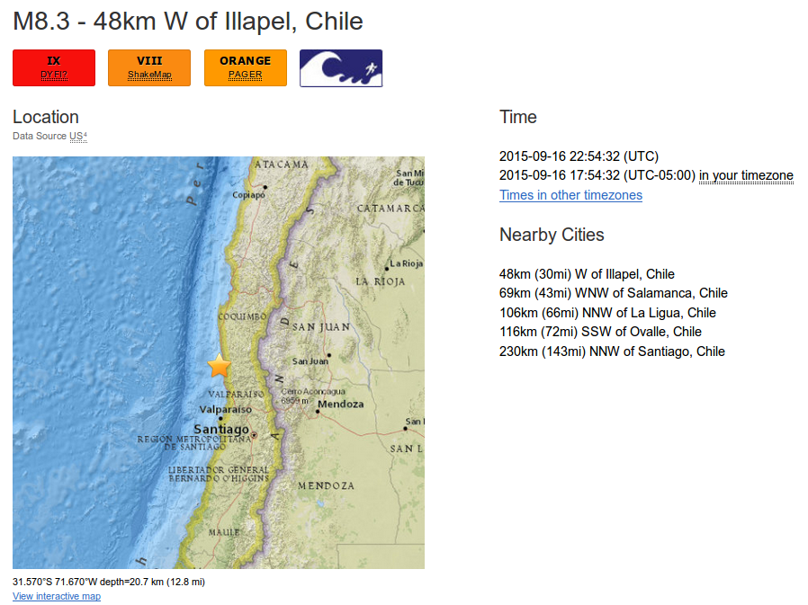
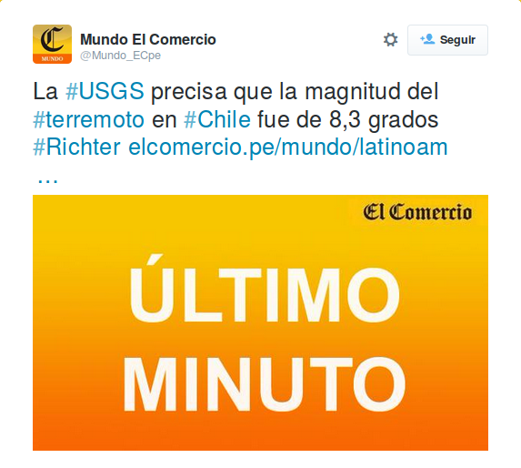
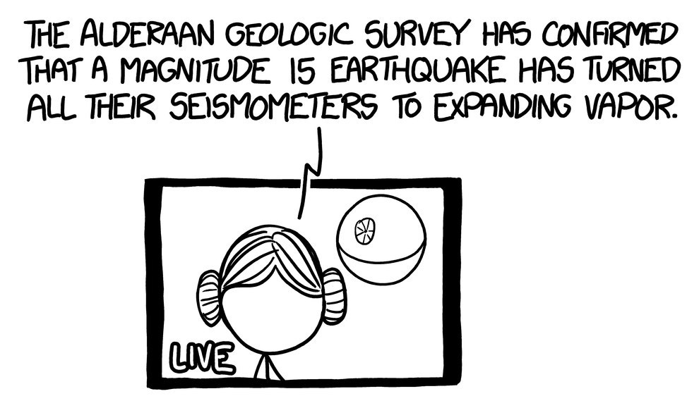
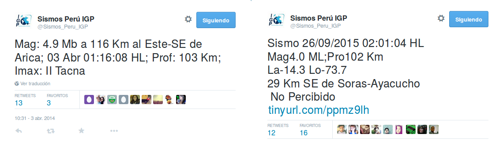
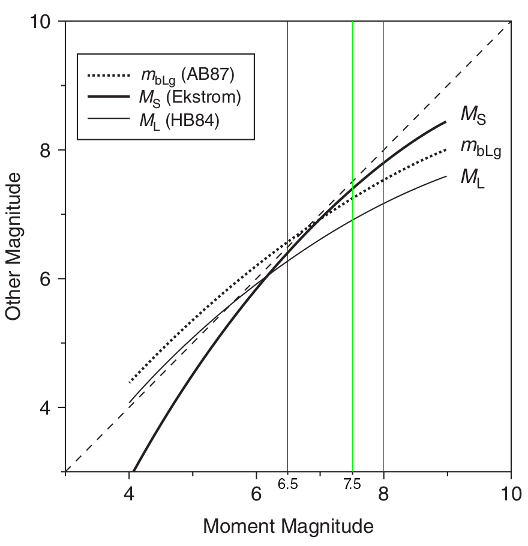

# Desterrando la escala de Richter.

Por Pablo Palacios Ávila [\@ppalaciosav](https://twitter.com/ppalaciosav)

Siempre que ocurre un terremoto en alguna parte del mundo, diferentes agencias 
geológicas no tardan en arrojar sus reportes sismológicos. Una de las más conocidas y confiables, el Servicio Geológico de los Estados Unidos (USGS) no tardó mucho en reportar las primeras cifras y datos respecto al último terremoto que azotó a Chile el último 16 de setiembre. Su portal web anunciaba así

** [Extracto del reporte sismológico del terremoto de Chile del 16 de setiembre 
del 2015. (http://earthquake.usgs.gov/earthquakes/eventpage/us20003k7a#general_summary)]**
En este tipo de situaciones, los medios de comunicación cumplen una labor esencial en la difusión de la información pertinente y de concernencia pública. Así, por ejemplo, El *Comercio* informaba a traves de su cuenta de Twitter de esta manera

** [Así retransmitió el decano de la prensa peruana.]**

Quizás hasta aquí no es fácil percatarse de que los redactores de este conocido medio de comunicación han caído en un error muy común al tratar de retransmitir el reporte de la USGS. De hecho, muchos medios de comunicación caen en el eterno error de anunciar "sismos de X grados en la escala de Richter" al punto tal de que hemos estados tan acostumbrados a leerlo de esta manera que se nos hace extraño comprender de que las escalas sismológicas **no son ni graduadas, ni de Richter en su mayoría**.

En primer lugar, una escala graduada, como la de grados Celsius, se define en base a dos valores arbitrarios entre los cuales se divide en una cierta cantidad de partes[1](#note1). Así, por ejemplo, tomando como referencia las temperaturas del punto de ebullición y del fusión del agua a 1 atmósfera y al dividir esta distancia en cien partes, se construye la escala de los grados Celsius. Este, por el contrario, no es el caso de las escalas sismológicas ya que su definición no es en base a valores relativos sino en relación a la energía liberada.

Otro detalle importante respecto a las escalas sismológicas es que estas son escalas logarítmicas. Dicho de otra forma, es una escala en la cual cada valor entero de magnitud es en realidad diez veces su valor antecesor. Así por ejemplo, un terremoto de magnitud 8 es equivalente a diez terremotos de magnitud 7.

Teniendo esto en mente, uno podría preguntarse cómo sería experimentar terremotos mayores a magnitud 9. Una buena idea mental nos la brinda Randall Munroe en su libro *What If?*

**["El servicio geológico de Alderaan ha confirmado que un terremoto de magnitud 15 ha vaporizado todos sus sismógrafos". (Tomado de [[2]](#note2)).]**

Tambien para magnitudes muy pequeñas,

**["Magnitud -2: Un gato cayendo desde un tocador". (Tomado de [[2]](#note2).]**

En segundo lugar, es importante dejar en claro de que, a diferencia de lo que se concibe en el imaginario popular, existen varias escalas sismológicas que se han creado a lo largo de la historia con el objetivo de cuantificar de manera objetiva qué tanta energía se libera en un movimiento telúrico y poder realizar posteriormente estudios, comparaciones y demás. En efecto, no fue hasta 1935 que C. F. Richter introdujo una escala logarítmica basada en medir la amplitud de las primeras ondas sísmicas que llegaban a un aparato llamado sismógrafo[3](#note3) (una especie de cardiograma que oscila con el ritmo de las vibraciones terrestres). Esta escala, denominada magnitud local ("ML") y comunmente conocida como *escala de Richter*, se utilizó en ese entonces para estudiar los sismos que se producían al sur de California, en EE.UU. Hoy en día, muchos de los servicios geológicos locales a nivel mundial siguen empleando la magnitud local mediante el filtrado de los registros digitales y simulando las condiciones empleadas en la metodología original de Richter[4](#note4). La escala de Richter, no obstante, resulta poco confiable para caracterizar sismos de magnitudes mayores a 6.5, además de no estar diseñada para trabajar con datos registrados a distancias mayores a 600Km del epicentro[5](#note5).

**[Charles Francis Richter (1900-1985)]**

A raíz de esta dificultad y ante la necesidad de medir la magnitud de los sismos de mayor energía, se crearon nuevas escalas que se basaron en la medición de otros parámetros característicos pero que fueran a su vez compatibles con la escala de Richter original. Es así que surgieron, entre ellas, la magnitud de onda superficial ("MS"), la magnitud de las ondas de cuerpo ("mb") y, la más importante, la magnitud de momento ("MW" o "M"). Esta última es la más confiable de todas, la única válida para magnitudes mayores a 8 y la preferida a usar en la mayoría de reportes sismológicos. Su superioridad radica en su definición en base a propiedades físicas de la fuente y no de cómo el movimiento telúrico se propaga, por lo que funciona tanto para sismos de bajas y altas magnitudes. 

Como podemos darnos cuenta, tenemos un buen número de escalas y no sólo la famosa escala Richter. Sin embargo, es importante señalar que todas estas escalas fueron diseñadas para ser consistentes entre sí, siempre y cuando se empleen fuera de sus rangos de saturación: aquellos intervalos para los cuales sus valores no son confiables. En este sentido, la escala de momento asume el rol de patrón de referencia en cuanto a la confiabilidad de una escala u otra.

**[Twitter del Instituto Geofísico del Perú (IGP) reportando en la escala mb (izquierda) y en la escala ML (derecha).]**

El hecho de que las diferentes escalas coincidan entre sí en sus respectivos rangos de confianza ofrece, además, la ventaja de poder estimar el valor de la magnitud de momento mediante alguna otra de las escalas mencionadas. Esto resulta bastante útil si se toma en cuenta de que la determinación de la magnitud de momento no es tan simple como las demás[6](#note6). En palabras del Dr. Hernando Tavera, director de Sismología del Instituto Geofísico del Perú (IGP) y quién amablemente nos explicó mejor esta situación; el fin que se busca es el de disponer de información lo más pronto posible. Si bien es cierto, la meta es migrar de manera definitiva a la magnitud de momento, el proceso de transición será paulatino.

**[Comparación entre MW, ML, MS y mb. La linea diagonal punteada corresponde a la escala MW (Tomado de [[7]](#note7)).]**

Ante este escenario y con la finalidad de brindar mayor claridad a la población, diversas agencias geológicas de diferentes países han adoptado ciertos protocolos en sus reportes. La USGS, por ejemplo, opta por sólo informar sobre la magnitud del sismo en cuestión sin indicar la escala sismológica empleada, reservando esta información sólo en caso de que esta sea solicitada; asimismo, se manejan tanto reportes sismológicos preliminares, siempre sujetos a actualizaciones en el breve lapso, como también reportes finales que indican únicamente magnitudes en la escala de momento.

**[La USGS opta por simplificar sus reportes.]**

Como se señaló al comienzo, los medios de comunicación juegan un rol importante en cuanto sirven de canal de acercamiento entre las entidades cientificas especializadas y la población. No obstante, cuando esta información se distorsiona se corre el riesgo de confundir a la población y de ponerla en un potencial peligro. Si bien es cierto el seguir empleando los términos "grados" y "escala de Richter" son errores cometidos por un gran número agencias de noticias a nivel mundial, nuestro país no puede darse el lujo de desconocer aspectos de un peligro constante para sus ciudadanos. Hablamos de un pais cuya capital posee cerca de la tercera parte de su población[8](#note8) y que no se encontraría preparada para hacerle frente a un sismo de magnitud 8.5[9](#note9). En consecuencia, la única forma de poder estar más preparados para lo peor es conocer y prevenir.

Por Pablo Palacios Ávila (@ppalaciosav)

<a id="note1">[1]</a>
*La escala de Richter y un error habitual*. Disponible en:
http://gaussianos.com/la-escala-de-richter-y-un-error-habitual/ (consultado el 30/09/2015).

<a id="note2">[2]</a>
Munroe, R. (2014) *What If?. Serious Scientific Answers to Absurd Hypothetical Questions*. Houghton Mifflin Harcourt. (pp. 291-292).

<a id="note3">[3]</a>
Fowler, C.M.R. (2005) *The Solid Earth. An Introduction to Global Geophysics*. Cambridge University Press. (2nd ed., p. 115)

<a id="note4">[4]</a>
Shearer, P. M. (2009) *Introduction to Seismology*. Cambridge University Press. (2nd ed., p. 282.)

<a id="note5">[5]</a>
*USGS Earthquake Magnitude Policy (implemented on January 18, 2002)*. Disponible en:
http://earthquake.usgs.gov/aboutus/docs/020204mag_policy.php (consultado el 30/09/2015).

<a id="note6">[6]</a>
Udias, A. (2000) *Principles of Seismology*. Cambridge University Press. (p. 288).

<a id="note7">[7]</a>
McCalpin, J. (2009) *Paleoseismology*. Academic Press – Appendix 1. (p. 2.)

<a id="note8">[8]</a>
*INEI: Lima cuenta con 9 millones 752 mil habitantes*. Disponible en: http://larepublica.pe/17-01-2015/inei-lima-tiene-9-millones-752-mil-habitantes
(consultado el 30/09/2015).

<a id="note9">[9]</a>
*Lima no está preparada para hacer frente a un terremoto de gran intensidad*.
Disponible en: https://redaccion.lamula.pe/2015/09/17/lima-no-esta-preparada-para-hacer-frente-a-un-terremoto-de-gran-intensidad/gabrielachiappe/
(consultado el 30/09/2015).